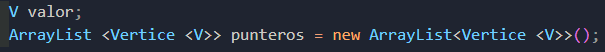
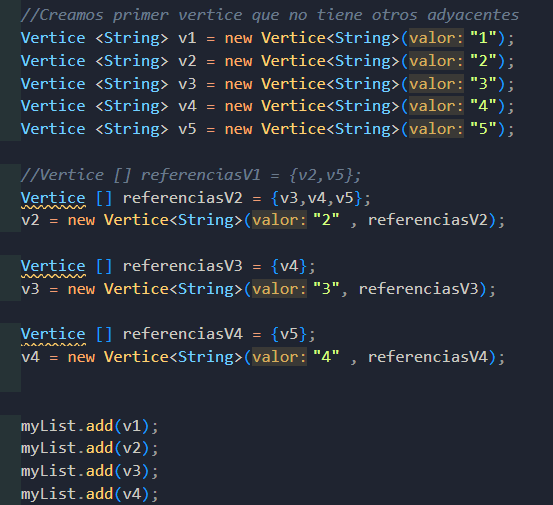
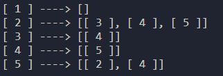
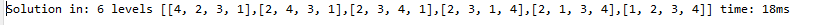
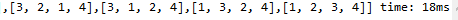
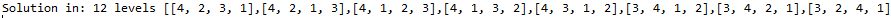
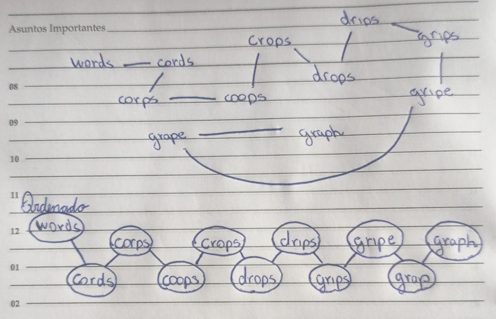
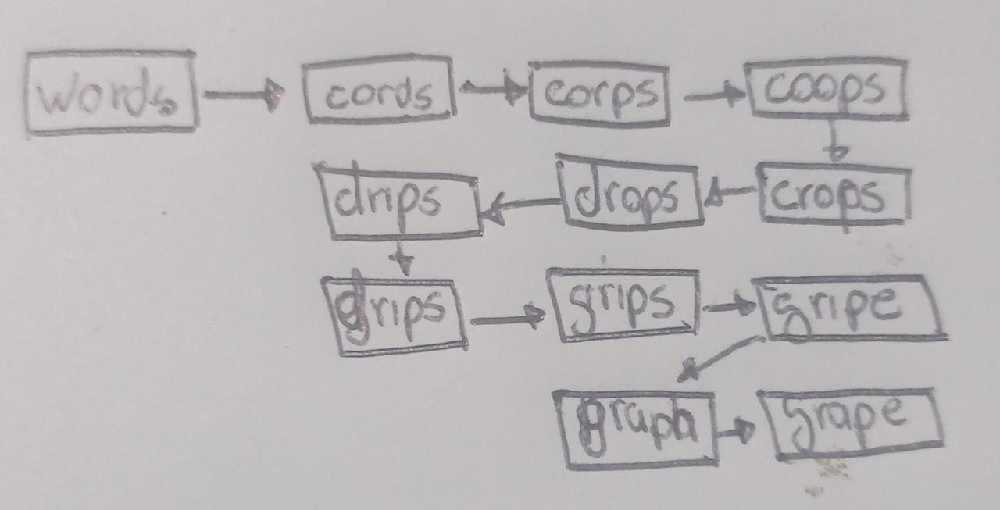
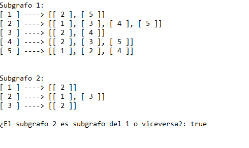

# EDA_Repositorio_Grupal_8
Grafos

<html>
   <head>
      <meta content="text/html; charset=UTF-8" http-equiv="content-type">
   </head>
   <body class="c40 doc-content">
      

         

         
         <table class="c53">
            <tr class="c59">
               <td class="c56" colspan="1" rowspan="1">
                  

               </td>
               <td class="c32" colspan="1" rowspan="1">
                  
UNIVERSIDAD NACIONAL DE SAN AGUSTIN

                  
FACULTAD DE INGENIER&Iacute;A DE PRODUCCI&Oacute;N Y SERVICIOS

                  
ESCUELA PROFESIONAL DE INGENIER&Iacute;A DE SISTEMA

               </td>
               <td class="c42" colspan="1" rowspan="1">
                  

               </td>
            </tr>
            <tr class="c50">
               <td class="c43" colspan="3" rowspan="1">
                  
Formato: Gu&iacute;a de Pr&aacute;ctica de Laboratorio / Talleres / Centros de Simulaci&oacute;n

               </td>
            </tr>
            <tr class="c28">
               <td class="c56" colspan="1" rowspan="1">
                  
Aprobaci&oacute;n: &nbsp;2022/03/01

               </td>
               <td class="c32" colspan="1" rowspan="1">
                  
C&oacute;digo: GUIA-PRLE-001

               </td>
               <td class="c42" colspan="1" rowspan="1">
                  
P&aacute;gina: 

               </td>
            </tr>
         </table>
         

      

      
INFORME DE LABORATORIO

      
(formato estudiante)

      
      <table class="c53">
         <tr class="c36">
            <td class="c1 c15" colspan="6" rowspan="1">
               
INFORMACI&Oacute;N B&Aacute;SICA

            </td>
         </tr>
         <tr class="c23">
            <td class="c5" colspan="1" rowspan="1">
               
ASIGNATURA: 

            </td>
            <td class="c45" colspan="5" rowspan="1">
               
Laboratorio - Estructura de datos y algoritmos

            </td>
         </tr>
         <tr class="c23">
            <td class="c5" colspan="1" rowspan="1">
               
T&Iacute;TULO DE LA PR&Aacute;CTICA: 

            </td>
            <td class="c45" colspan="5" rowspan="1">
               
Grafos

            </td>
         </tr>
         <tr class="c23">
            <td class="c5" colspan="1" rowspan="1">
               
N&Uacute;MERO DE PR&Aacute;CTICA:

            </td>
            <td class="c31" colspan="1" rowspan="1">
               
08

            </td>
            <td class="c30" colspan="1" rowspan="1">
               
A&Ntilde;O LECTIVO:

            </td>
            <td class="c25" colspan="1" rowspan="1">
               
2022 - A

            </td>
            <td class="c25" colspan="1" rowspan="1">
               
NRO. SEMESTRE:

            </td>
            <td class="c14" colspan="1" rowspan="1">
               
III

            </td>
         </tr>
         <tr class="c23">
            <td class="c5" colspan="1" rowspan="1">
               
FECHA DE PRESENTACI&Oacute;N

            </td>
            <td class="c31" colspan="1" rowspan="1">
               
14/08/2022

            </td>
            <td class="c30" colspan="1" rowspan="1">
               
HORA DE PRESENTACI&Oacute;N

            </td>
            <td class="c20" colspan="3" rowspan="1">
               

            </td>
         </tr>
         <tr class="c23">
            <td class="c16" colspan="4" rowspan="1">
               
INTEGRANTE (s): 

               <ul class="c29 lst-kix_list_5-0 start">
                  <li class="c7 li-bullet-0">Garay Bedregal C&eacute;sar Alejandro - cgarayb@unsa.edu.pe</li>
                  <li class="c7 li-bullet-0">Chua Aguilar Jean Carlo Leonel - jchua@unsa.edu.pe</li>
                  <li class="c7 li-bullet-0">Cahuana Aguilar Josu&eacute; Math&iacute;as Miguel - jcahuanaag@unsa.edu.pe</li>
                  <li class="c7 li-bullet-0">Huisa Perez Willy Alexander - whuisa@unsa.edu.pe</li>
               </ul>
               

            </td>
            <td class="c25" colspan="1" rowspan="1">
               
NOTA:

            </td>
            <td class="c14" colspan="1" rowspan="1">
               

            </td>
         </tr>
         <tr class="c23">
            <td class="c1" colspan="6" rowspan="1">
               
DOCENTE(s):

               
Richart Smith Escobedo Quispe - rescobedoq@unsa.edu.pe

               

            </td>
         </tr>
      </table>
      

      
      <table class="c53">
         <tr class="c36">
            <td class="c1 c15" colspan="1" rowspan="1">
               
SOLUCI&Oacute;N Y RESULTADOS

            </td>
         </tr>
         <tr class="c19">
            <td class="c41" colspan="1" rowspan="1">
               <ol class="c29 lst-kix_list_4-0 start" start="1">
                  <li class="c0 li-bullet-1">SOLUCI&Oacute;N DE EJERCICIOS/PROBLEMAS</li>
               </ol>
               
2. Implementar el c&oacute;digo de Grafo cuya representaci&oacute;n sea realizada mediante Lista de Adyacencia.

               
Recordemos que en teor&iacute;a de grafos, una lista de adyacencia es una representaci&oacute;n de todas las aristas o arcos de un grafo mediante una lista.

               
Si el grafo es no dirigido, cada entrada es un conjunto de dos v&eacute;rtices conteniendo los dos extremos de la arista correspondiente. Si el grafo es dirigido, cada entrada es una tupla de dos nodos, uno denotando el nodo fuente y el otro denotando el nodo destino del arco correspondiente.

               
As&iacute; teniendo en cuenta este concepto se implemento un grafo haciendo uso de Listas, en donde los atributos del V&eacute;rtice &nbsp;(Vertice.java) son los siguientes : 

               

               

               
As&iacute; todas las v&eacute;rtices adyacentes se almacenan en una estructura din&aacute;mica. &nbsp;En el archivo ListaAdyacencia.java se implemento toda la funcionalidad, haciendo operaciones como enlazar v&eacute;rtices y verificar si ya se relacionaban uno con otro. Tambien se implemento un m&eacute;todo toString para una mejor visualizaci&oacute;n de como ser&aacute; el resultado. Finalmente el archivo Ejercicio1.java es en donde se realizo la actividad.

               

               

               

               

               

               

               
3. Implementar BSF, DFS y Dijkstra con sus respectivos casos de prueba. (5 puntos)

               

               
En la implementaci&oacute;n de los m&eacute;todos de b&uacute;squeda BFS, DFS y Dijkstras se utilizaron principalmente las clases nodo y la principal, a excepci&oacute;n de Dijkstra en la que se utiliz&oacute; la clase tag.

               
En la ejecuci&oacute;n del BFS:

               

               

               

               
En la ejecuci&oacute;n del DFS:

               

               
Si se desea observar los c&oacute;digos con detenimiento se tienen en el repositorio github.

               

               
4. Solucionar el siguiente ejercicio: (5 puntos)

               
El grafo de palabras se define de la siguiente manera: cada v&eacute;rtice es una palabra en el idioma Ingl&eacute;s y dos palabras son adyacentes si difieren exactamente en una posici&oacute;n. Por ejemplo, las cords y los corps son adyacentes, mientras que los corps y crops no lo son.

               

               
a) Dibuje el grafo definido por las siguientes palabras: words cords corps coops crops drops drips grips gripe grape graph.

               

               

               

               
b) Mostrar la lista de adyacencia del grafo. 

               

               

               

               

               

               
5. Realizar un m&eacute;todo en la clase Grafo. Este m&eacute;todo permitir&aacute; saber si un grafo est&aacute; incluido en otro. Los par&aacute;metros de entrada son 2 grafos y la salida es true si hay inclusi&oacute;n y false en el caso contrario

               

               
Para implementar el m&eacute;todo se us&oacute; como base el c&oacute;digo del ejercicio 2. Se cambi&oacute; el nombre de la clase listaAdyacencia&nbsp;por Grafo y se agreg&oacute; el m&eacute;todo subgrafo(). Este m&eacute;todo recibe 2 grafos, determina cu&aacute;l es el m&aacute;s peque&ntilde;o, en cantidad de v&eacute;rtices, y lo asigna como subgrafo. Se empieza en el primer vector, de este se comparan las referencias de este con todos los vectores del grafo m&aacute;s grande, si luego de revisar todos los vectores del grafo grande no hay ning&uacute;n match se retorna false, si en cambio hay un match se pasar&aacute; al siguiente vector del grafo m&aacute;s peque&ntilde;o. Si todos los vectores del grafo peque&ntilde;o tienen match se retorna True.

               

               

               

               

               

               

               

               

               

               

               

               

               

               

               

               

               

               

               

            </td>
         </tr>
         <tr class="c27">
            <td class="c41" colspan="1" rowspan="1">
               <ol class="c29 lst-kix_list_4-0" start="2">
                  <li class="c17 c35 li-bullet-1">SOLUCI&Oacute;N DEL CUESTIONARIO</li>
               </ol>
               <ul class="c29 lst-kix_list_1-0 start">
                  <li class="c10 c48 li-bullet-0">&iquest;Cu&aacute;ntas variantes del algoritmo de Dijkstra hay y cu&aacute;l es la diferencia entre ellas? (1 puntos)</li>
               </ul>
               
Hay muchas variables para este algoritmo, algunos ser&iacute;an el algoritmo de Bellman, el de Floyd y Warshall, entre otros. Se diferencian en que las variantes se especializan en un aspecto diferente y que se las puede ver como una optimizaci&oacute;n del algoritmo de Dijkstra. &nbsp;

               

               <ul class="c29 lst-kix_list_1-0">
                  <li class="c10 c48 li-bullet-0">Investigue sobre los ALGORITMOS DE CAMINOS MINIMOS e indique, &iquest;Qu&eacute; similitudes encuentra, qu&eacute; diferencias, en qu&eacute; casos utilizar y porque? (2 puntos)</li>
               </ul>
               
Los algoritmos de caminos m&iacute;nimos m&aacute;s reconocidos son:

               <ul class="c29 lst-kix_n881x8y9qi1h-0 start">
                  <li class="c10 c48 li-bullet-0">Bellman - Ford: Resuelve nuestro problema de los caminos m&aacute;s cortos considerando los valores ponderados negativos, al igual que Dijkstra, parte de un nodo inicial y se dirige al resto del grafo.</li>
                  <li class="c10 c48 li-bullet-0">B&uacute;squeda A*Utiliza el an&aacute;lisis y heur&iacute;stica para resolver el problema de caminos m&iacute;nimos, parte de un nodo origen y se dirige a otro del grafo siempre y cuando se cumplan ciertas condiciones. </li>
                  <li class="c10 c48 li-bullet-0">Floyd - Warshall: Resuelve el problema pero sin partir de un nodo inicial, sino lo hace uniendo todos los nodos entre todos.</li>
                  <li class="c10 c48 li-bullet-0">Johnson: Es bastante similar a Floyd-Warshall, ya que resuelve el problema del camino m&aacute;s corto entre todos los nodos pero siguiendo un algoritmo diferente, en grafos de baja intensidad es m&aacute;s efectivo.</li>
                  <li class="c10 c48 li-bullet-0">Viterbi: Resuelve el problema del camino m&aacute;s corto de manera estoc&aacute;stica, agregando un peso probabil&iacute;stico en cada nodo, es el m&eacute;todo que m&aacute;s se diferencia de Dijkstra y su efectividad no es &uacute;nica y var&iacute;a de acuerdo a la intensidad del grafo.</li>
               </ul>
               

               

               

            </td>
         </tr>
         <tr class="c27">
            <td class="c41" colspan="1" rowspan="1">
               <ol class="c29 lst-kix_list_4-0" start="3">
                  <li class="c0 li-bullet-1">CONCLUSIONES</li>
               </ol>
               <ul class="c29 lst-kix_list_2-0 start">
                  <li class="c7 li-bullet-0">La b&uacute;squeda de los grafos m&iacute;nimos nos permiten obtener un camino &oacute;ptimo para recorrer un grafo en el menor tiempo posible utilizando diferentes m&eacute;todo como pueden ser BFS, DFS y Dijkstra.</li>
                  <li class="c7 li-bullet-0">En la vida cotidiana, la aplicaci&oacute;n de los grafos pueden ser vistas en todos los problemas que puedan analizarse desde un punto de vista optimizable, osease que si de tiempo de ejecuci&oacute;n habl&aacute;semos, siempre habr&aacute; un camino m&aacute;s corto.</li>
                  <li class="c7 li-bullet-0">La construcci&oacute;n de grafos utilizando listas enlazadas permite el acceso de los nodos a los que es adyacente un nodo de partida, de esta manera accediendo al valor de cada uno se puede establecer un camino corto implementando alguno de los m&eacute;todos mencionados.</li>
               </ul>
            </td>
         </tr>
      </table>
      

      
      <table class="c53">
         <tr class="c36">
            <td class="c1 c15" colspan="1" rowspan="1">
               
RETROALIMENTACI&Oacute;N GENERAL

            </td>
         </tr>
         <tr class="c27">
            <td class="c41" colspan="1" rowspan="1">
               

               

            </td>
         </tr>
      </table>
      

      
      <table class="c53">
         <tr class="c36">
            <td class="c1 c15" colspan="1" rowspan="1">
               
REFERENCIAS Y BIBLIOGRAF&Iacute;A

            </td>
         </tr>
         <tr class="c47">
            <td class="c41" colspan="1" rowspan="1">
               <ul class="c29 lst-kix_ihznnfuxb5v9-0 start">
                  <li class="c51 li-bullet-0">https://es.wikipedia.org/wiki/Problema_del_camino_m%C3%A1s_corto</li>
               </ul>
            </td>
         </tr>
      </table>
      

      

   </body>
</html>